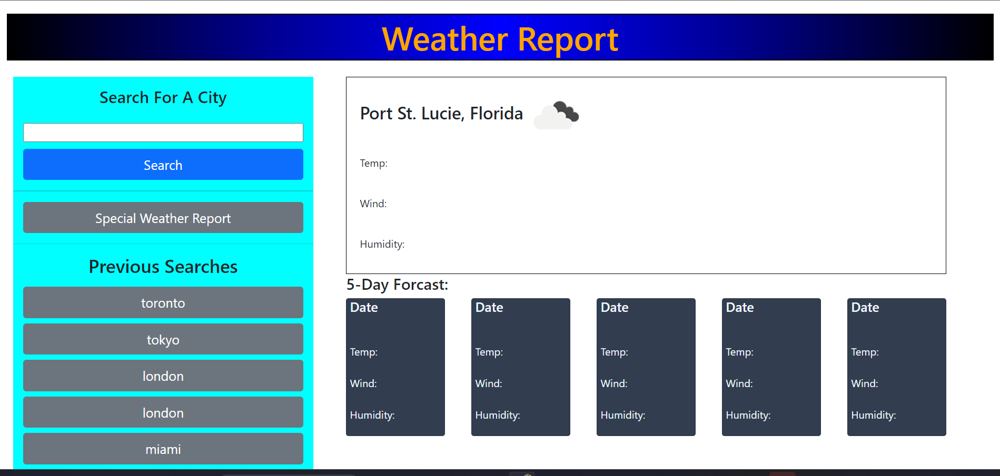
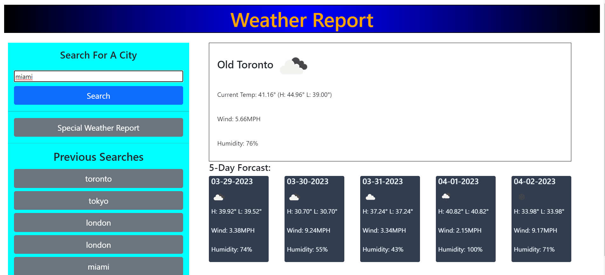
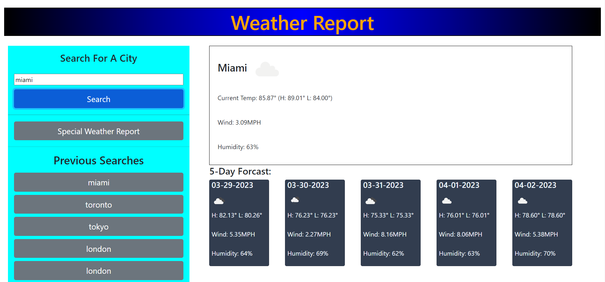
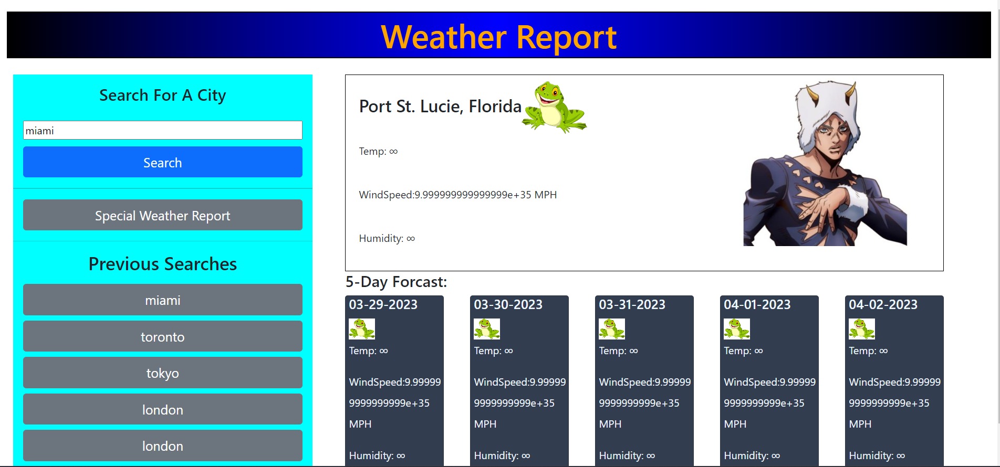

# Weather Report

## Description
 
    - This is meant to help the user keep track of the weather in different cities around the   world.
    - Using this the user can find the current temp, windspeed, humidity and a picture describing the weather status
    - The user also can see the weather for the next 5 days as well
    - By using this I have been increasing my knowledge of how to fetch api's and manipulating the DOM

## Usage

- To begin the user must type a city name into the input on the left

- Once the user clicks the search button the cities weather info will be updated to the DOM

- If you're a JOJO fan then click the special weather report button lol

## Links

-Github repo: https://github.com/QDatcher/Weather-Report
-Live Site: https://qdatcher.github.io/Weather-Report/
